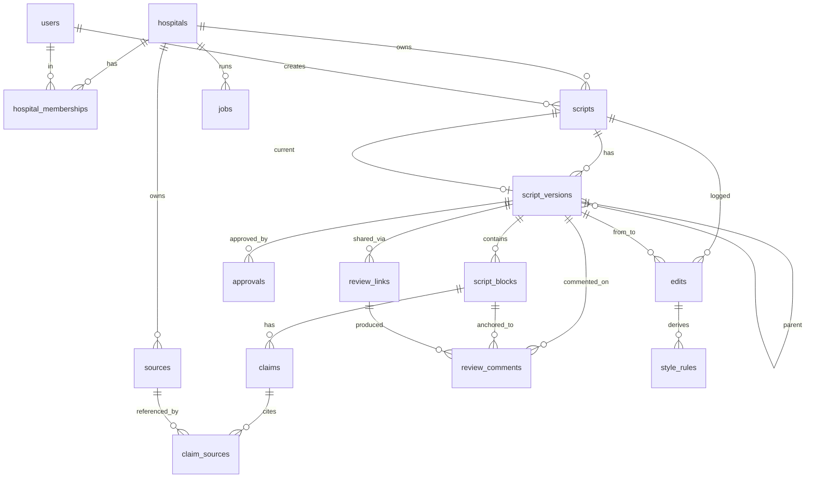

# P0/P1 — 최종 ERD · 스키마 · FK · Unique · 마이그레이션 Rollback (구현 전 보고)

승인 범위: **PostgreSQL 데이터 모델 + SQLAlchemy/Alembic 구조 + 기존 JSON→v1 마이그레이션(이명 1편) + claim=unverified + evidence 재검사 + 변환 전후 렌더 비교**. 이 보고 승인 후 1단계 구현 착수.

---

## 0. 스택·원칙 확정

- **운영 DB**: PostgreSQL (시스템 오브 레코드). 로컬/단위테스트: SQLite. 연결: `DATABASE_URL`.
- ORM: **SQLAlchemy**, 스키마 마이그레이션: **Alembic**. 데이터 마이그레이션(JSON→DB)은 Alembic과 분리한 **멱등 스크립트** `store/migrate.py`.
- `out/<topic>_package.json` = **원본 아님, 내보내기·백업 산출물**. 시스템 원본은 DB.
- **PK = UUID**(`gen_random_uuid()`) — 열거·IDOR 방지. 공개 식별자도 UUID. 타임스탬프 = `timestamptz`.
- **버전·블록·claim = immutable**. 편집은 새 `script_version` 생성(원본 보존).
- **enum 값은 CHECK 제약**으로 고정(PG enum 대신 CHECK — 값 추가 마이그레이션이 가벼움).

## 1. 테넌트 격리 메커니즘 (전 테이블 공통)

1. 모든 테넌트 테이블에 `hospital_id UUID NOT NULL` + `UNIQUE(hospital_id, id)`.
2. 자식→부모 참조는 **복합 FK** `(hospital_id, parent_id) → 부모(hospital_id, id)`.
   → 서로 다른 병원의 행은 **DB 레벨에서 연결 불가**(교차 병원 데이터 링크 원천 차단).
3. `hospital_id`는 **클라이언트 입력을 신뢰하지 않고** 세션/멤버십/리뷰토큰에서 서버가 결정.
4. 모든 repository 메서드는 `tenant_ctx(hospital_id)` 필수 인자. 전 쿼리에 `hospital_id` 조건 강제(공통 베이스 리포지토리에서 주입).
5. 예외: `users`(전역), `style_rules`의 `scope=global`(의도적 교차 테넌트) — 이 둘만 hospital 스코프 밖.

---

## 2. ERD (관계 개요)

계보 흐름: **hospital → script → version(immutable) → block → claim → claim_source → source**. 검수/승인은 **version** 귀속. 댓글은 **version + (선택)block+anchor**. 편집이력 `edits` → 승인 후 `style_rules` → 다음 생성 프롬프트 주입.

---

## 3. 테이블별 스펙 (필드 · PK · FK · UNIQUE · INDEX)

표기: 🔑=PK, ▲=복합FK(hospital_id 포함), ⚑=UNIQUE, ⌕=INDEX. 모든 테넌트 테이블은 공통으로 `⚑(hospital_id, id)` 보유.

### hospitals  *(테넌트 루트)*
- 🔑 `id uuid`
- `slug text NOT NULL` — URL·config 식별자(예: `boncure`)
- `name text NOT NULL`, `status text CHECK(active|suspended|archived) DEFAULT active`
- `created_at timestamptz DEFAULT now()`
- ⚑ `slug`

### users  *(전역, 테넌트 밖)*
- 🔑 `id uuid`
- `email citext NOT NULL`, `name text`, `pw_hash text NULL`(reviewer는 없음)
- `created_at timestamptz`
- ⚑ `email`

### hospital_memberships
- 🔑 `id uuid`, `hospital_id uuid`, `user_id uuid`
- `role text CHECK(editor|reviewer|approver|admin)`
- FK `hospital_id→hospitals(id)`, `user_id→users(id)`
- ⚑ `(hospital_id, user_id, role)` · ⌕ `(user_id)`

### scripts  *(대본 프로젝트)*
- 🔑 `id uuid`, `hospital_id uuid`
- `speaker_id uuid NULL`(FK→users, 화자), `topic text NOT NULL`
- `status text CHECK(draft|in_review|approved|archived) DEFAULT draft`
- `current_version_id uuid NULL` — **deferrable FK**(scripts↔versions 순환 회피, v1 생성 후 세팅)
- `created_by uuid`(FK→users), `created_at`, `updated_at`
- FK `hospital_id→hospitals(id)`, ▲`(hospital_id, current_version_id)→script_versions(hospital_id, id)`
- ⚑ `(hospital_id, id)` · ⌕ `(hospital_id, topic)`

### script_versions  *(immutable 스냅샷)*
- 🔑 `id uuid`, `hospital_id uuid`, `script_id uuid`
- `parent_version_id uuid NULL`, `version_no int NOT NULL`
- `source text CHECK(ai|editor|migration)`, `creation_reason text`
- `source_package_hash text NULL`(마이그레이션 원본 checksum — 멱등키)
- `created_by uuid NULL`(FK→users), `created_at`
- ▲`(hospital_id, script_id)→scripts(hospital_id, id)`, ▲`(hospital_id, parent_version_id)→script_versions(hospital_id, id)`
- ⚑ `(hospital_id, script_id, version_no)` · ⚑ `(hospital_id, id)` · ⚑ `(hospital_id, source_package_hash)`(멱등) · ⌕ `(hospital_id, script_id)`
- **불변**: UPDATE/DELETE 금지(앱 계층 + 선택적 트리거).

### script_blocks  *(버전당 immutable)*
- 🔑 `id uuid`, `hospital_id uuid`, `version_id uuid`
- `stable_block_key text NOT NULL`(버전 넘어 문단 계보 추적)
- `order_index int NOT NULL`, `block_type text CHECK(intro|explanation|evidence|transition|analogy|example|summary|cta|other)`
- `scene text NULL`, `text text NOT NULL`, `tc_start text NULL`, `tc_end text NULL`
- `metadata jsonb DEFAULT '{}'`(tags·`migration_inferred`·기타)
- ▲`(hospital_id, version_id)→script_versions(hospital_id, id)`
- ⚑ `(hospital_id, version_id, order_index)` · ⚑ `(hospital_id, version_id, stable_block_key)` · ⚑ `(hospital_id, id)` · ⌕ `(hospital_id, version_id)`

### claims
- 🔑 `id uuid`, `hospital_id uuid`, `version_id uuid`, `block_id uuid`
- `sentence_index int`, `claim_index int DEFAULT 0`, `start_offset int NULL`, `end_offset int NULL`
- `claim_text text NOT NULL`
- `claim_type text CHECK(term_definition|cause|mechanism|treatment_effect|test_interpretation|statistic|study_result|association|patient_judgment|other)`
- `support_level text CHECK(direct|partial|inferred|unsupported|unverified) DEFAULT unverified`
- `medical_risk text CHECK(low|medium|high) DEFAULT medium`
- `verification_status text CHECK(pending|verified|failed) DEFAULT pending`
- `detection_method text CHECK(llm|regex|migration)`, `created_at`
- ▲`(hospital_id, version_id)→script_versions`, ▲`(hospital_id, block_id)→script_blocks(hospital_id, id)`
- ⚑ `(hospital_id, block_id, sentence_index, claim_index)` · ⚑ `(hospital_id, id)` · ⌕ `(hospital_id, version_id)`, `(support_level)`

### sources
- 🔑 `id uuid`, `hospital_id uuid`
- `title text NOT NULL`, `source_type text CHECK(paper|kb|survey|interview|lecture|competitor_meta|other)`
- `file_path text NULL` / `object_key text NULL`(**파일 본체는 저장소, DB엔 경로만**)
- `citation_metadata jsonb DEFAULT '{}'`(저널·연도·저자·권호·DOI), `checksum text NULL`, `created_at`
- FK `hospital_id→hospitals(id)`
- ⚑ `(hospital_id, checksum)`(중복 방지) · ⚑ `(hospital_id, id)`

### claim_sources  *(문장↔근거 연결)*
- 🔑 `id uuid`, `hospital_id uuid`, `claim_id uuid`, `source_id uuid`
- `source_quote text NULL`, `page_or_location text NULL`
- `relation_type text CHECK(directly_supports|partially_supports|contradicts|context_only)`
- `confidence real NULL`, `verified_by uuid NULL`(FK→users), `verified_at timestamptz NULL`, `created_at`
- ▲`(hospital_id, claim_id)→claims(hospital_id, id)`, ▲`(hospital_id, source_id)→sources(hospital_id, id)`
- ⚑ `(hospital_id, claim_id, source_id)` · ⚑ `(hospital_id, id)`

### approvals  *(version 귀속)*
- 🔑 `id uuid`, `hospital_id uuid`, `version_id uuid`, `approver_id uuid`(FK→users)
- `status text CHECK(approved|revoked|rejected)`, `reason text NULL`
- `approved_at timestamptz NULL`, `revoked_at timestamptz NULL`, `created_at`
- ▲`(hospital_id, version_id)→script_versions(hospital_id, id)`
- ⚑ **부분 유니크** `(hospital_id, version_id) WHERE status='approved' AND revoked_at IS NULL` — 버전당 활성 승인 1개 · ⚑ `(hospital_id, id)`
- **새 버전은 무조건 미승인 시작**(이전 승인 복사 금지).

### review_links  *(외부 검토 링크, version 고정)*
- 🔑 `id uuid`, `hospital_id uuid`, `version_id uuid`
- `token_hash text NOT NULL`(**원본 토큰 저장 안 함**; `token_urlsafe(32)` 발급 시 1회 노출)
- `reviewer_name text NULL`, `permission text CHECK(comment_only|approve) DEFAULT comment_only`
- `created_by uuid`(FK→users), `expires_at timestamptz NOT NULL`, `revoked_at timestamptz NULL`, `last_accessed_at timestamptz NULL`, `created_at`
- ▲`(hospital_id, version_id)→script_versions(hospital_id, id)`
- ⚑ `token_hash` · ⚑ `(hospital_id, id)` · ⌕ `(version_id)`

### review_comments
- 🔑 `id uuid`, `hospital_id uuid`, `version_id uuid`
- `block_id uuid NULL`(전체 의견=null), `anchor_start int NULL`, `anchor_end int NULL`
- `review_link_id uuid NULL`(어느 링크에서 왔나; 내부 댓글=null)
- `reviewer_name text NOT NULL`, `comment text NOT NULL`(**저장·렌더 양측 escape**)
- `status text CHECK(open|accepted|rejected|resolved|needs_discussion) DEFAULT open`
- `resolved_by uuid NULL`(FK→users), `resolved_at timestamptz NULL`, `created_at`
- ▲`(hospital_id, version_id)→script_versions`, ▲`(hospital_id, block_id)→script_blocks`, ▲`(hospital_id, review_link_id)→review_links(hospital_id, id)`
- ⚑ `(hospital_id, id)` · ⌕ `(hospital_id, version_id)`, `(block_id)`, `(status)`

### edits  *(수정 이벤트)*
- 🔑 `id uuid`, `hospital_id uuid`, `script_id uuid`
- `from_version_id uuid NULL`, `to_version_id uuid NOT NULL`, `stable_block_key text NOT NULL`
- `before_text text`, `after_text text`
- `category text CHECK(tone|awkwardness|factual|source_grounding|transition|disclaimer|intro|cta|other)`
- `reason text NULL`, `scope text CHECK(global|hospital|doctor|topic) DEFAULT hospital`
- `approved_for_learning bool DEFAULT false`, `created_by uuid`(FK→users), `created_at`
- ▲`(hospital_id, script_id)→scripts`, ▲`(hospital_id, to_version_id)→script_versions`, ▲`(hospital_id, from_version_id)→script_versions`
- ⚑ `(hospital_id, id)` · ⌕ `(hospital_id, script_id)`, `(category)`, `(approved_for_learning)`

### style_rules  *(hospital_id NULL 허용=global)*
- 🔑 `id uuid`
- `hospital_id uuid NULL`(FK→hospitals), `doctor_id uuid NULL`(FK→users), `topic_scope text NULL`
- `scope text CHECK(global|hospital|doctor|topic)`, `category text`
- `rule_text text NOT NULL`, `positive_example text NULL`, `negative_example text NULL`
- `source_edit_ids uuid[] NULL`, `status text CHECK(proposed|approved|retired) DEFAULT proposed`
- `approved_by uuid NULL`(FK→users), `created_at`
- ⌕ `(scope)`, `(hospital_id)`, `(status)`
- 주의: global 규칙은 테넌트 밖(복합 FK 미적용). **자동 승격 금지** — `status=approved`만 프롬프트 주입.

### jobs  *(기존 sqlite에서 이관)*
- 🔑 `id uuid`, `hospital_id uuid`(FK→hospitals), `topic text`, `status text`, `ok bool NULL`, `log text`, `started_at`, `updated_at`
- ⌕ `(hospital_id, updated_at)` — 최신 작업 조회. (기존 `hospital PK` 단일행 → 이력형으로 확장)

---

## 4. 마이그레이션 · Rollback 방식

**원칙**: 비파괴 · 멱등 · 트랜잭션 · 전후 렌더 검증.

**DDL(Alembic)**: 스키마는 Alembic revision으로 생성, `downgrade()`로 롤백 가능. jobs 이관도 Alembic revision(신규 테이블 생성 → 데이터 복사 → 구 테이블 보관).

**데이터 마이그레이션(`store/migrate.py`, 멱등)**:
1. 각 `out/<topic>_package.json` 읽어 **checksum(sha256)** 계산.
2. `script_versions.source_package_hash`에 이미 존재하면 **skip**(멱등). — 재실행 안전.
3. 한 대본 = **단일 트랜잭션**:
   - `scripts` 1행 → `script_versions` v1(`source=migration`, hash 기록) → `script_blocks`(원본 `tc·block·scene·say·tags` 보존, `stable_block_key=blk_0001..`, `block_type`은 휴리스틱 + `metadata.migration_inferred=true`).
   - `say` **문장 분할**(offset 유지) → 의료 claim 후보 추출 → `claims`에 **`support_level=unverified`, `verification_status=pending`**로 등록(❗기존 데이터는 대조 전이므로 inferred 아님).
4. 트랜잭션 커밋 후 **evidence checker 재실행** → claim을 direct/partial/inferred/unsupported로 재분류(자기신고 불신, 원문 대조).
5. **변환 전후 렌더 비교**: DB v1 → 렌더 결과 vs 원본 `_package.html`(공백 정규화) 비교. 불일치 임계 초과 시 **해당 대본 롤백 + 리포트**.
6. 원본 JSON은 삭제하지 않고 `out/_backup/`(읽기전용)로 복사 보존.
7. **실패 처리**: 대본 단위 트랜잭션 롤백 → 다음 대본 계속(부분 실패 격리) → 실패 목록 리포트. 전체 중단 옵션도 제공.

**롤백 시나리오**:
- 스키마: `alembic downgrade -1`.
- 데이터: 멱등 설계라 재실행으로 보정. 잘못 들어간 버전은 `source_package_hash` 기준 식별해 삭제(트랜잭션). 원본 JSON 백업으로 항상 복구 가능.

---

## 5. 이번 단계 산출물 & 다음

**이번(승인 요청) 산출물**:
- ERD(위) · SQLAlchemy 모델 · Alembic 초기 revision · `store/repositories.py`(tenant 강제 베이스) · `store/migrate.py`(이명 1편 변환·검증) · 변환 전후 렌더 비교 리포트.

**아직 안 함**: UI 개편 · 외부 리뷰 링크 공개 · Correction Memory 적용 · YouTube · 제목/썸네일 · 원본 JSON 삭제.

**다음 승인 후 단계**: 3(편집·diff·재검사) → 4(Source Grounding 게이트) → 5(리뷰 링크) → 6(Correction Memory + Style Rule 7종).

---

## 6. 확인 필요 소소한 결정 (기본값 제안)

1. **파일 저장소**: 소스 원본 파일은 로컬 `data/<h>/raw`(현행) 유지 vs 객체스토리지(S3/R2). → 제안: **1단계는 경로만 DB화(현행 파일 유지)**, 배포 영구화 때 객체스토리지 전환.
2. **speaker/doctor 엔티티**: 지금은 `users`로 대용(speaker_id→users). 원장 다수/외부화자 필요해지면 별도 `doctors` 테이블 분리. → 제안: **users 대용으로 시작**.
3. **claim 문장 단위**: 한 문장 다중 claim 허용(`claim_index`). → 제안대로 유지.
